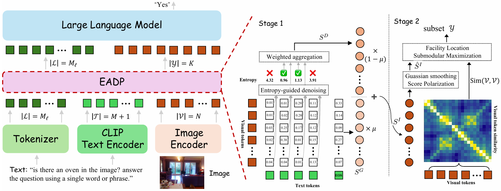

# EADP: Entropy-Aware Dense Visual Token Pruning



Official implementation for **Combating Textual Noise and Redundancy: Entropy-Aware Dense Visual Token Pruning**.

EADP is a training-free visual token pruning method for efficient Vision-Language Models (VLMs). It targets two common failure modes in aggressive visual token pruning:

- **Textual noise in dense cross-modal scoring**: dense token-level instruction guidance can preserve fine-grained details, but noisy or weakly grounded text tokens may corrupt the importance map.
- **Redundant and fragmented token selection**: top-k selection tends to chase local peaks, often keeping redundant patches while dropping visually or semantically complementary regions.

EADP addresses these issues by combining entropy-aware dense instruction scoring with structured token selection. It first filters noisy text tokens using the entropy of their spatial similarity distributions, fuses the denoised dense signal with global semantic guidance, and then selects tokens through a facility-location style submodular objective with spatial priors. This produces compact visual representations that preserve fine-grained cues under strict token budgets.

## Repository Overview

This repository contains three experimental tracks:

| Module | Backbone | Scope | Entry README |
| --- | --- | --- | --- |
| `LLaVA/` | LLaVA-1.5 / LLaVA-1.6 | image VQA evaluation and efficiency analysis | [LLaVA/README.md](LLaVA/README.md) |
| `LLaVA_Video/` | LLaVA-Video-7B-Qwen2 | video understanding evaluation | [LLaVA_Video/README.md](LLaVA_Video/README.md) |
| `Qwen_vl/` | Qwen2.5-VL / Qwen3-VL | image VQA evaluation with VLMEvalKit | [Qwen_vl/README.md](Qwen_vl/README.md) |

Each module has its own environment file, model setup, dataset instructions, and run scripts.

## Supported Methods

The public scripts cover:

- Baseline: no visual token pruning
- [CDPruner](https://arxiv.org/abs/2506.10967)
- [DivPrune](https://arxiv.org/abs/2503.02175)
- [HiPrune](https://arxiv.org/abs/2508.00553)
- EADP

## Method Highlights

EADP follows a two-stage pruning pipeline.

**1. Entropy-aware dense instruction scoring**

EADP computes dense text-visual relevance instead of relying only on a single global text embedding. To suppress dispersed textual noise, it measures the entropy of each text token's spatial similarity distribution and filters high-entropy tokens. The retained dense guidance is aggregated and fused with global semantic context to obtain a robust instruction relevance map.

**2. Redundancy-aware structured selection**

Instead of selecting the top-scoring visual tokens independently, EADP formulates token selection as a facility-location style submodular maximization problem. The objective encourages the selected tokens to cover the original visual content holistically, reducing redundancy and preserving fine-grained evidence. Spatial smoothing and score polarization are used to stabilize the relevance map before selection.

For high-resolution or multi-patch settings such as LLaVA-NeXT, EADP also supports dynamic token allocation across image patches.

## Installation

Install the environment for the module you want to run.

LLaVA:

```bash
cd LLaVA
conda env create -f environment.yml
conda activate pruner
```

LLaVA-Video:

```bash
cd LLaVA_Video
conda env create -f environment.yml
conda activate llava-video
```

Qwen-VL:

```bash
cd Qwen_vl
conda env create -f environment.yml
conda activate qwen-vl
```

Alternatively, each module also provides a `requirements.txt` for installation in an existing Python environment.

## Quick Start

### LLaVA

Run EADP efficiency evaluation on LLaVA-1.5:

```bash
cd LLaVA

python scripts/run_efficiency_eval.py \
  --model-version v1.5 \
  --methods eadp \
  --tokens 32 64 128 \
  --datasets vizwiz_val textvqa \
  --max-samples 200 \
  --alpha 0.5 \
  --beta 1.0 \
  --output-dir efficiency
```

For standard LLaVA benchmark evaluation, see [LLaVA/EVAL.md](LLaVA/EVAL.md). For efficiency metrics and arguments, see [LLaVA/efficiency/README.md](LLaVA/efficiency/README.md).

### LLaVA-Video

Run EADP on LLaVA-Video:

```bash
cd LLaVA_Video

export MODEL_PATH=/path/to/LLaVA-Video-7B-Qwen2
export HF_HOME=$HOME/.cache/huggingface
export GPU_IDS="0"
export DATASETS="mvbench"
export TOKENS="32"
export EADP_ALPHA=0.5
export EADP_BETA=2.0

bash scripts/run_eadp.sh
```

See [LLaVA_Video/README.md](LLaVA_Video/README.md) for model and dataset preparation.

### Qwen-VL

Run EADP on Qwen2.5-VL-7B:

```bash
cd Qwen_vl

export MODEL_FAMILY=qwen2.5-7b
export LMUData=$HOME/LMUData
export GPU_IDS="0"
export DATASETS="MMBench_DEV_EN_V11"
export TOKENS="256"
export EADP_ALPHA=0.5
export EADP_BETA=2.0

bash scripts/run_eadp.sh
```

See [Qwen_vl/README.md](Qwen_vl/README.md) for Qwen2.5-VL, Qwen3-VL, and efficiency evaluation instructions.

## Models and Datasets

Please refer to the module-level READMEs:

- [LLaVA/README.md](LLaVA/README.md)
- [LLaVA_Video/README.md](LLaVA_Video/README.md)
- [Qwen_vl/README.md](Qwen_vl/README.md)

The image experiments cover common VLM benchmarks such as VQAv2, GQA, VizWiz, ScienceQA, TextVQA, POPE, MME, MMBench, MMVet, ChartQA, OCRBench, and AI2D depending on the module. The video experiments cover MVBench, LongVideoBench, and Video-MME.

## Repository Structure

```text
.
├── LLaVA/          # LLaVA-1.5 / LLaVA-1.6 image experiments
├── LLaVA_Video/    # LLaVA-Video experiments
├── Qwen_vl/        # Qwen2.5-VL / Qwen3-VL experiments with VLMEvalKit
└── assets/         # visualization assets and examples
```

## Citation

If you find our work useful, please consider citing:
```bibtex
@inproceedings{wang2026eadp,
  title     = {Combating Textual Noise and Redundancy: Entropy-Aware Dense Visual Token Pruning},
  author    = {Wang, Xuehui and Yang, Xuankun and Shen, Wei},
  booktitle = {Proceedings of the European Conference on Computer Vision (ECCV)},
  year      = {2026},
  url       = {https://github.com/SJTU-DeepVisionLab/EADP}
}
```

## Acknowledgements

## Acknowledgements

This project builds on the open-source ecosystems of [LLaVA](https://github.com/haotian-liu/LLaVA), [LLaVA-Video](https://github.com/LLaVA-VL/LLaVA-NeXT), [Qwen-VL](https://github.com/QwenLM/Qwen-VL)/[Qwen3-VL](https://github.com/QwenLM/Qwen3-VL), [VLMEvalKit](https://github.com/open-compass/VLMEvalKit), [CDPruner](https://github.com/Theia-4869/CDPruner), [DivPrune](https://github.com/vbdi/divprune), and [HiPrune](https://github.com/Danielement321/HiPrune). We thank the authors and contributors of these projects.
